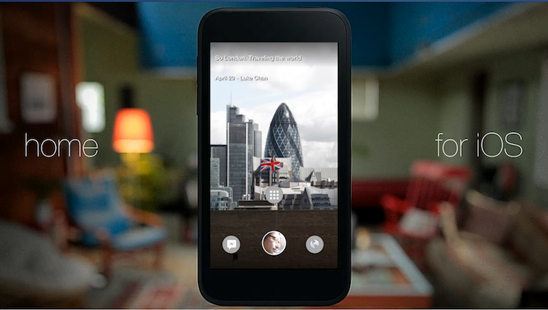

Home for iOS
===============================

This is an attempt to replicate essential elements of the Facebook Home experience in iOS as an app. The aim is to re-create features like Cover Feed with nothing but simple UIKit 
controls and the Facebook Graph API.

I will be updating this documentation and writing development notes at:

* http://corgitoergosum.net/2013/04/29/facebook-home-for-ios/

Working Features
---
* Coverfeed. Supports posts of type photo (added_photos/mobile_status_update/shared_story) and status (picture/mobile_status_update/wall_post).
* Double tap to like/unlike a post from Coverfeed.
* View comments and add comments to a post.
* Post to your own timeline.
* Fake launcher that opens apps like Facebook Camera, Twitter, Instagram, Mail.
* SSO to Facebook using iOS 6's SocialFramework.

Missing Features / Known Issues
---
* Notifications
* Chat Heads
* Non Retina 4-inch displays support
* Intermittent crashes

License
---
MIT (https://github.com/kenshin03/Home-For-iOS/blob/master/LICENSE)

Videos
---
[Vimeo Video](https://vimeo.com/64940276 "Demo Video 1")

[Vimeo Video](https://vimeo.com/63531931 "Demo Video 2")

