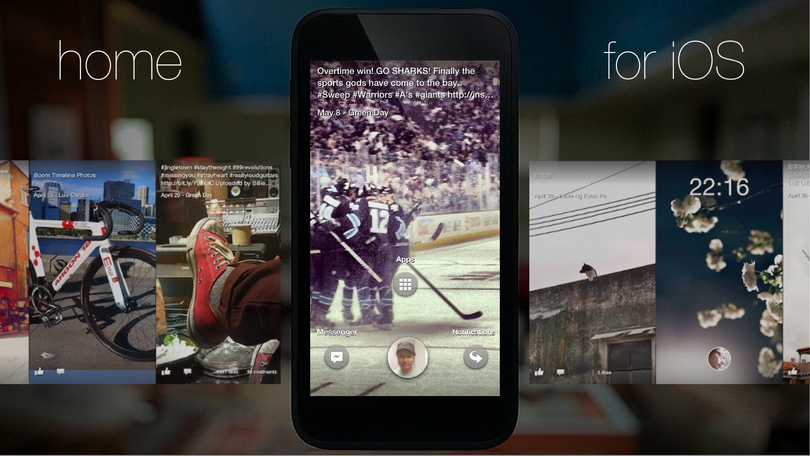
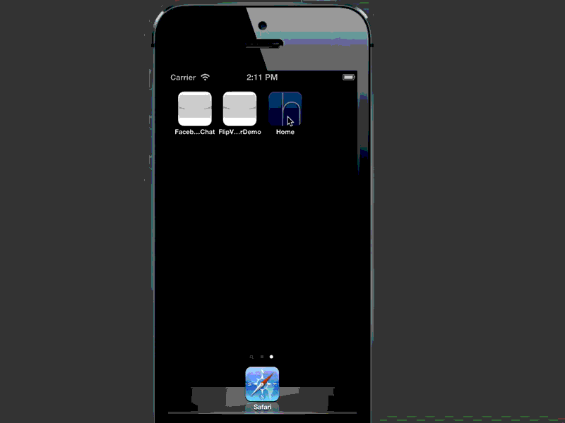

Home for iOS
===============================

Last updated: May 31

This is an attempt to replicate essential elements of the Facebook Home experience in iOS, as an *app*. The aim is to re-create features like Cover Feed with basic UIKit 
controls and the Facebook Graph API. 

Development Notes:

* [Project Page](http://corgitoergosum.net/facebook-home-for-ios/ "Project Page")
* [Intro](http://corgitoergosum.net/2013/04/29/facebook-home-for-ios/ "Intro")
* [Building Home (1) – Data Layer](http://corgitoergosum.net/2013/04/30/building-facebook-home-for-ios-1-data-layer/ "Building Home (1) – Data Layer")
* [Building Home (2) – Cover Feed](http://corgitoergosum.net/2013/05/01/building-facebook-home-for-ios-2-cover-feed/ "Building Home (2) – Cover Feed")
* [Building Home (3) – Menu and App Launcher](http://corgitoergosum.net/2013/05/09/building-facebook-home-for-ios-3-menu-and-app-launcher/ "Building Home (3) – Menu and App Launcher")
* [Building Home (4) - Notifications](http://corgitoergosum.net/2013/05/17/building-facebook-home-for-ios-4-notifications/ "Building Home (4) - Notifications")

Videos
---

[Vimeo Video](https://vimeo.com/64940276 "Demo Video 1")

[Vimeo Video](https://vimeo.com/63531931 "Demo Video 2")

Installation
---
* git clone / pull
* cd Home-For-iOS/Home
* (optional) pod install / pod update
* open and build from Home.xcworkspace
* For installation on devices, please create a facebook app that matches the app bundle id you are using. See https://github.com/kenshin03/Home-For-iOS/issues/5.

Working Features
---
* Coverfeed. Supports posts of type photo (added_photos/mobile_status_update/shared_story) and status (picture/mobile_status_update/wall_post).
* Double tap to like a post from Coverfeed.
* View comments and add comments to a post.
* Post to your own timeline.
* Fake launcher that opens pre-installed apps like Facebook Camera, Twitter, Instagram, Mail via URL schemes.
* SSO to Facebook using iOS 6's SocialFramework.
* Read Facebook Notifications

In-progress
---
* Messaging 
   * View Controller to list contacts to write message to
   * Message compose view with textfield and send button
   * Code to send message to graph ID via XMPP
   * Code to listen to XMPP notification and message compose view / animate in chathead.
* UX
   * Coverfeed - Timer based auto-scroll to next view
   * Coverfeed - Auto-refresh of timeline contents after x minutes
* Authentication
   * Auto-retry failed authentication after detecting a change in settings.

Contribution
---
Feel free to fork and work on any features or fix any issues as you see fit. Or submit an issue with feature requests or bug reports.

License
---
MIT (https://github.com/kenshin03/Home-For-iOS/blob/master/LICENSE)

